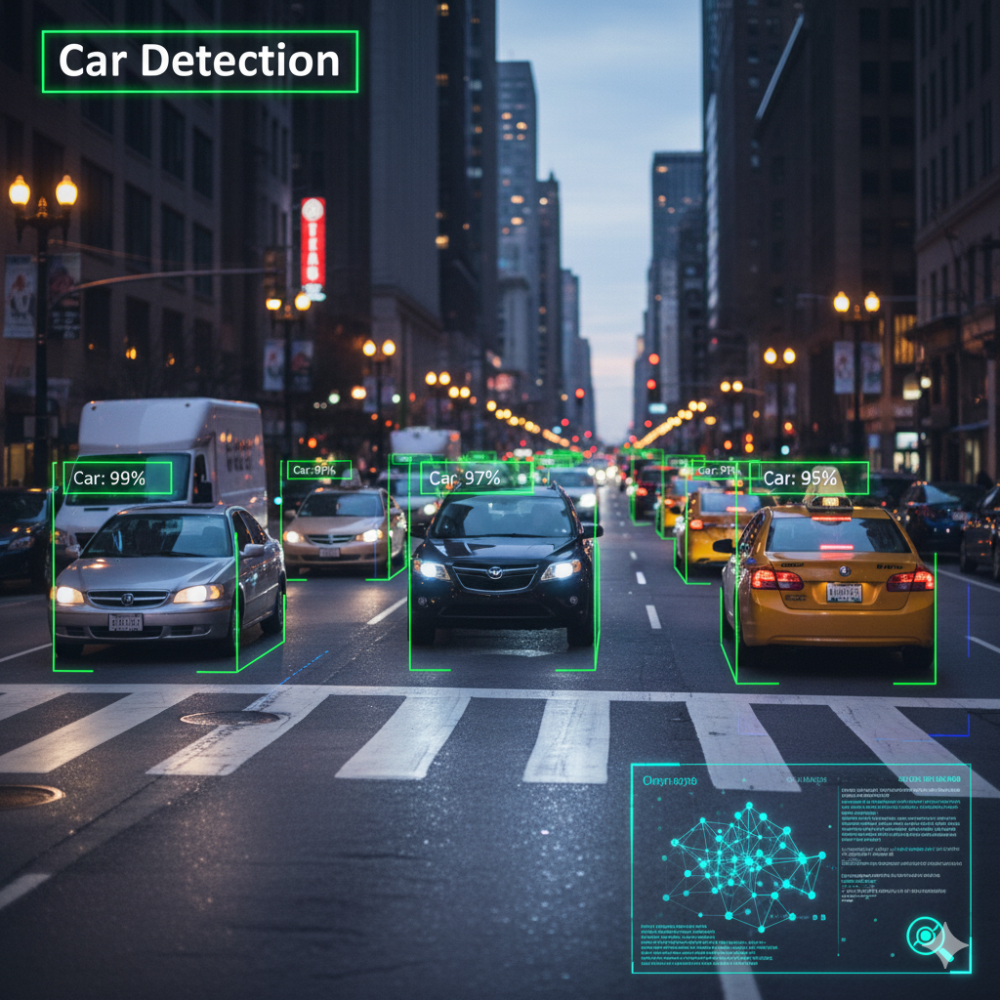
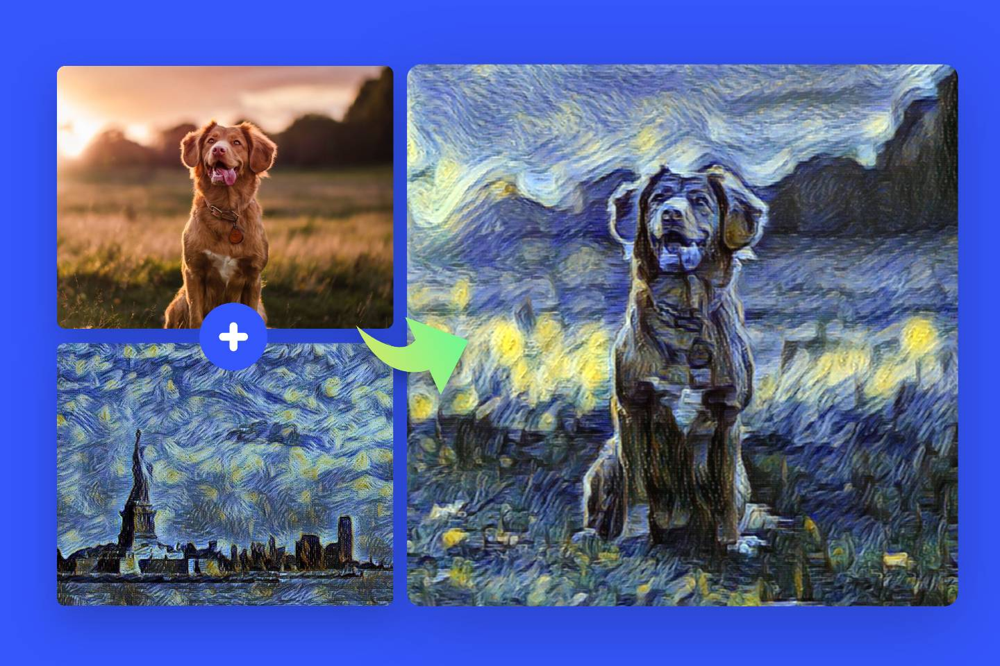
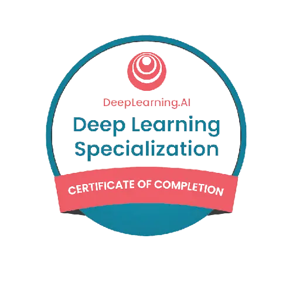

<h1 align="center">Deep Learning Specialization — Portfólio de Projetos</h1>

<p align="center">
<strong>Implementações e anotações da especialização da DeepLearning.AI por Andrew Ng</strong>
</p>

<p align="center">
  
  
  
  
</p>

<p align="center">
<a href="#-objetivo-principal">Objetivo</a> •
<a href="#-showcase-de-projetos-em-destaque">Projetos</a> •
<a href="#-estrutura-do-repositório">Estrutura</a> •
<a href="#-como-executar-localmente">Como Executar</a> •
<a href="#️-licença-e-créditos">Licença</a>
</p>

---

## 🎯 Objetivo Principal
Este repositório é o meu portfólio prático da **Deep Learning Specialization**.  
O objetivo é mostrar, executar e replicar os projetos do curso, com instruções claras para rodar localmente, visualizar os experimentos e adaptar os códigos para aplicações reais.

---

## 📚 Sobre a Especialização
A *Deep Learning Specialization* é um programa de 5 cursos que ensina desde os fundamentos de redes neurais até arquiteturas avançadas para **visão computacional** e **NLP**.

<details>
<summary><strong>Detalhes dos 5 cursos</strong></summary>

- **Neural Networks and Deep Learning**: fundamentos, forward/backward propagation, funções de ativação, primeira rede neural.  
- **Improving Deep Neural Networks**: regularização (L2, Dropout), batch norm, otimizadores (Momentum, RMSprop, Adam).  
- **Structuring Machine Learning Projects**: análise de erro, métricas e ciclo de vida de produção.  
- **Convolutional Neural Networks (CNNs)**: arquiteturas LeNet, AlexNet, VGG, ResNet e Inception aplicadas a visão computacional.  
- **Sequence Models**: RNNs, LSTMs, GRUs, embeddings e Transformers para NLP.  

</details>

---

## ✨ Showcase de Projetos em Destaque

<table>
<tr>
<td align="center" width="50%">
<strong>Detecção de Carros em Imagens (Object Detection)</strong><br/><br/>
<br/><br/>
<small>Esse é um projeto clássico da especialização, usando YOLO-like models para detectar carros em imagens de tráfego.</small><br/><br/>
<a href="https://github.com/gaab-braga/DeepLearningSpecialization/blob/main/n02_CNN/n02_Object_detec/n00_Autonomous_driving_application_Car_detection.ipynb">➡️ Ver o Notebook</a>
</td>

<td align="center" width="50%">
<strong>Geração de Arte com Neural Style Transfer</strong><br/><br/>
<br/><br/>
<small>Esse é bem visual: gerar imagens aplicando o estilo de uma obra de arte em uma foto.</small><br/><br/>
<a href="https://github.com/gaab-braga/DeepLearningSpecialization/blob/main/n02_CNN/n03_Face_recog/n01_Art_Generation_with_Neural_Style_Transfer.ipynb">➡️ Ver o Notebook</a>
</td>
</tr>
</table>

---

## 📂 Estrutura do Repositório
```
📁 n00_NN/              → Fundamentos de Redes Neurais
📁 n01_Improving_DNN/   → Regularização, Batch Norm, Otimização
📁 n02_CNN/             → Projetos de Visão Computacional
📁 n03_SM/              → Modelos Sequenciais e NLP
📄 README.md            → Apresentação
```

---

## 🚀 Como Executar Localmente

```bash
# 1. Clone o repositório
git clone https://github.com/gaab-braga/DeepLearningSpecialization.git
cd DeepLearningSpecialization

# 2. Crie e ative um ambiente virtual
python -m venv .venv
# Windows: .venv\Scripts\activate
# macOS/Linux: source .venv/bin/activate

# 3. Instale as dependências
pip install -r requirements.txt

# 4. Inicie o Jupyter Lab
jupyter lab
```

---

## 💡 Dicas e Contribuições
- Sugestões? Abra uma *issue*.  
- Melhorias? Pull Requests são bem-vindos.  
- Datasets grandes → usar scripts de download em vez de adicionar ao repo.  

---

## ⚖️ Licença e Créditos
Este repositório contém minhas implementações dos exercícios da especialização.  
Uso educacional e de portfólio, respeitando a licença original do curso.  

Créditos: **Andrew Ng & DeepLearning.AI (Coursera)**  

---
<p align="center">
  
</p>